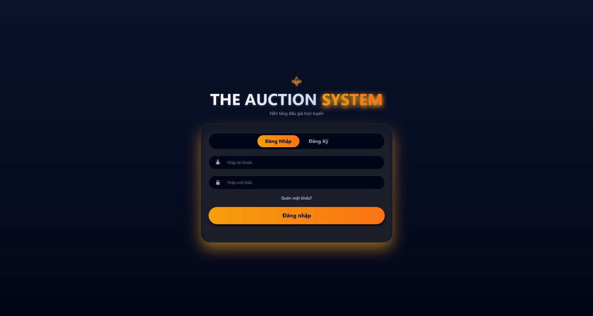
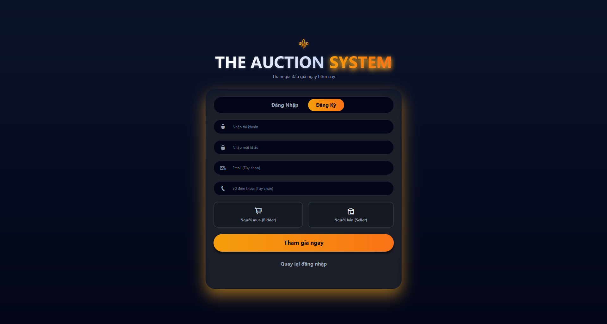
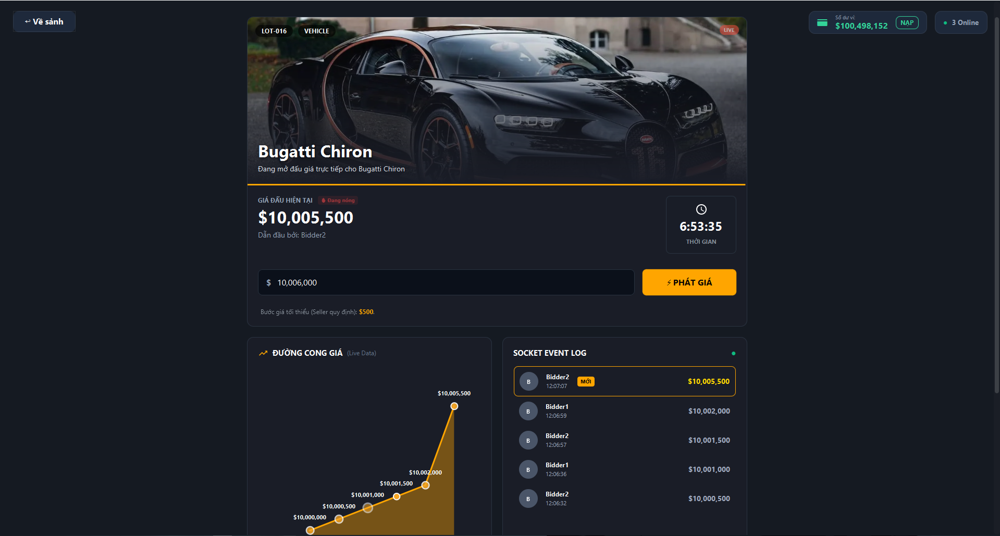
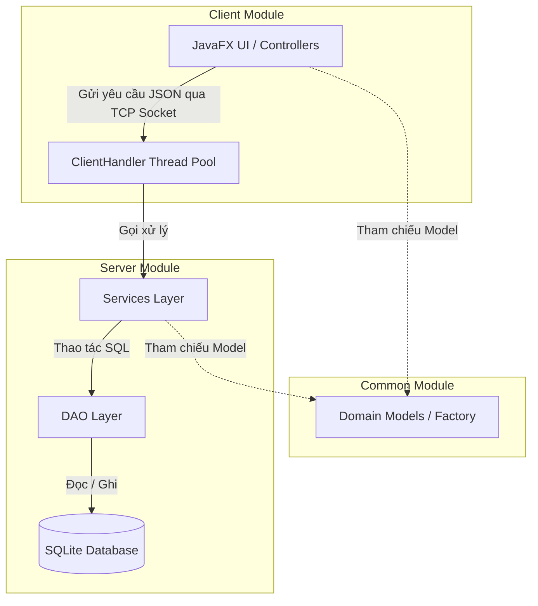
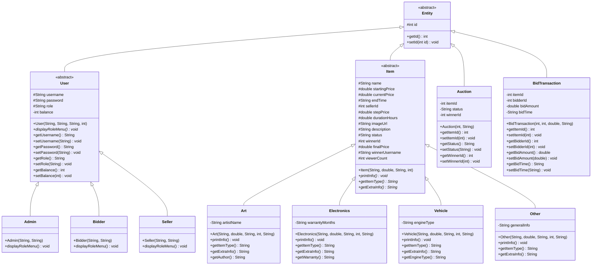
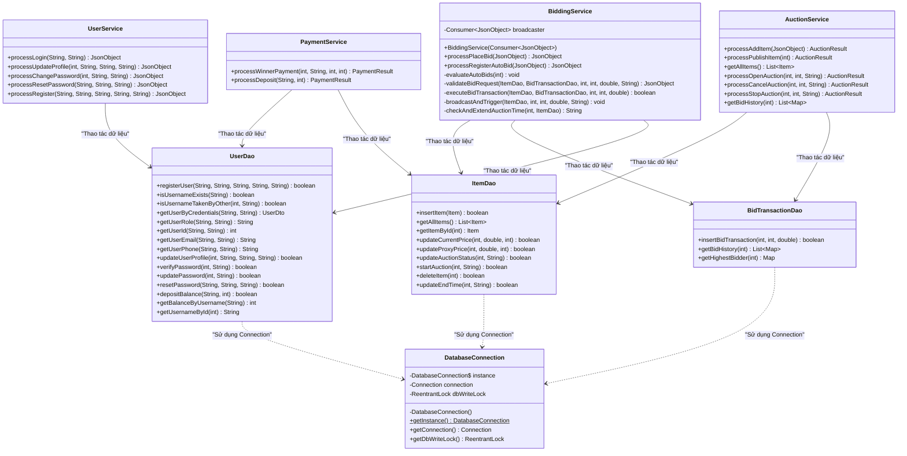
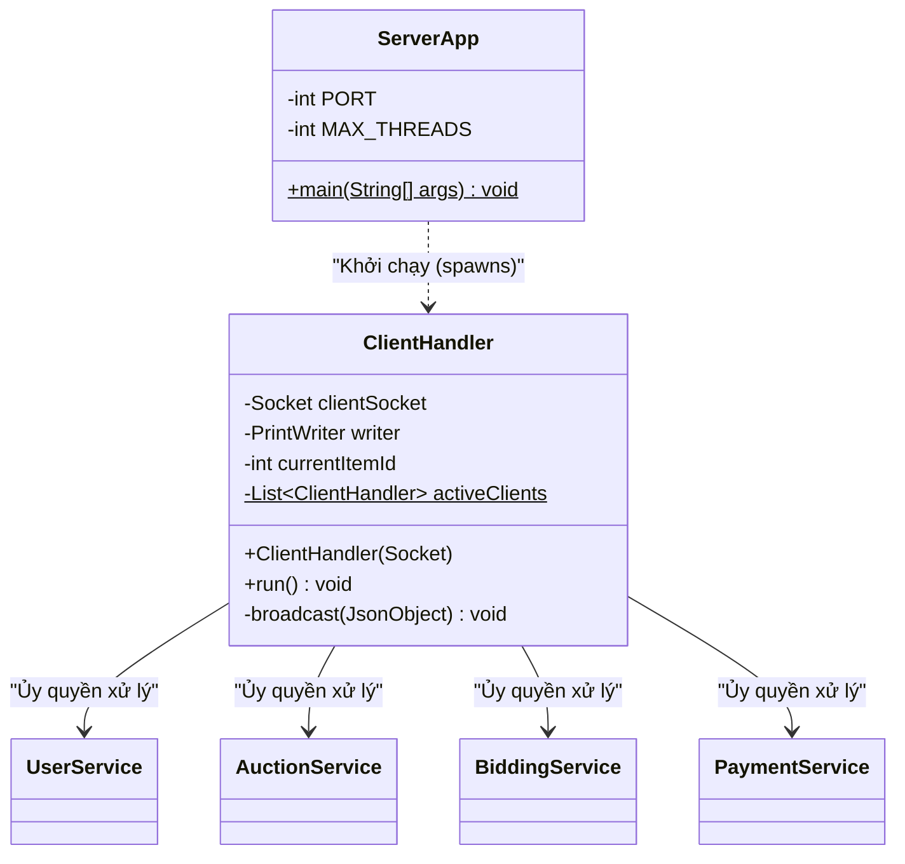
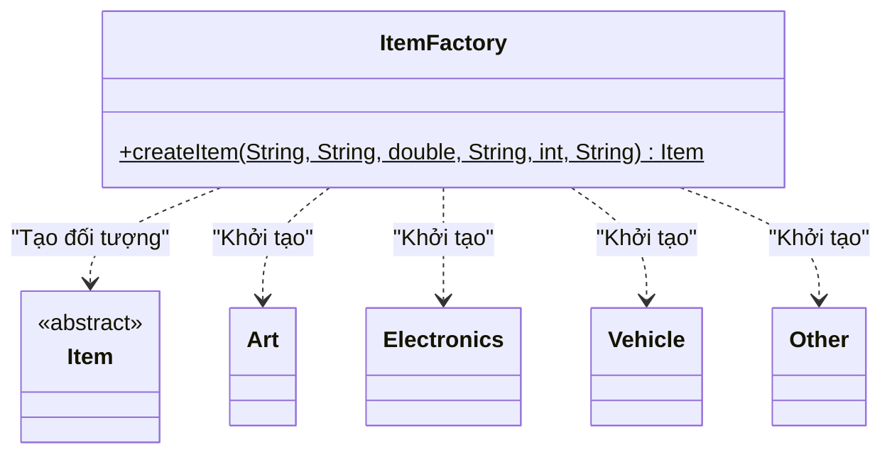

<div align="center">
  

  <h1>Hệ Thống Đấu Giá Trực Tuyến (Online Auction System)</h1>
  <p><i>Báo cáo Bài tập lớn môn Lập trình Nâng cao (2526II_UET.CS2043_9)</i></p>

  <!-- Badges -->
  
  
  
  
</div>

<hr/>

**Thông tin nhóm thực hiện: Nhóm 3**
- **Lớp:** QH-2025-I/CQ-I-CS2

| STT | Họ và tên | Mã sinh viên | Link GitHub |
| :---: | :--- | :---: | :---: |
| 1 | Phạm Tuấn Nghĩa | 25021912 | [🔗 GitHub](https://github.com/tuannghiapham2210) |
| 2 | Trần Khánh Nam | 25021908 | [🔗 GitHub](https://github.com/tknamvn) |
| 3 | Trịnh Quang Hưng | 25021814 | [🔗 GitHub](https://github.com/TrinhHung1510-me) |
| 4 | Trần Danh Tuấn Anh | 25021638 | [🔗 GitHub](https://github.com/trandanhtuananh) |

---

## Mục lục
1. [Mô tả bài toán và phạm vi hệ thống](#1-mô-tả-bài-toán-và-phạm-vi-hệ-thống)
2. [Công nghệ và Yêu cầu môi trường](#2-công-nghệ-và-yêu-cầu-môi-trường)
3. [Cấu trúc thư mục](#3-cấu-trúc-thư-mục)
4. [Vị trí các file .jar (Thực thi)](#4-vị-trí-các-file-jar-thực-thi)
5. [Hướng dẫn chạy Server/Client theo thứ tự](#5-hướng-dẫn-chạy-serverclient-theo-thứ-tự)
6. [Danh sách chức năng đã hoàn thành](#6-danh-sách-chức-năng-đã-hoàn-thành-theo-yêu-cầu-đồ-án)
7. [Tài liệu Báo cáo & Video Demo](#7-tài-liệu-báo-cáo--video-demo)
8. [Giao diện hệ thống (Screenshots)](#8-giao-diện-hệ-thống-screenshots)
9. [Sơ đồ lớp UML (UML Class Diagrams)](#9-sơ-đồ-lớp-uml-uml-class-diagrams)
10. [Hạn chế của hệ thống (Known Limitations)](#10-hạn-chế-của-hệ-thống-known-limitations)

---

## 1. Mô tả bài toán và phạm vi hệ thống

### Bài toán
Hệ thống đấu giá truyền thống thường gặp khó khăn về giới hạn không gian, thời gian và thiếu tính minh bạch trong quá trình ghi nhận giá thầu. Hệ thống Đấu giá Trực tuyến (Online Auction System) được xây dựng nhằm cung cấp một nền tảng giao dịch số hóa, cho phép người dùng tham gia đấu giá các vật phẩm theo thời gian thực một cách công bằng, an toàn và minh bạch.

### Phạm vi hệ thống
Hệ thống hoạt động theo mô hình Client-Server, giao tiếp qua giao thức TCP Socket. Hệ thống hỗ trợ đa kết nối đồng thời với các vai trò phân quyền chi tiết:
- **Admin:** Giám sát hoạt động của hệ thống, quản lý người dùng và các phiên đấu giá.
- **Seller (Người bán):** Đăng tải sản phẩm, thiết lập quy định đấu giá (giá khởi điểm, bước giá, thời gian).
- **Bidder (Người mua):** Quản lý số dư, tìm kiếm sản phẩm và đặt giá thầu trong thời gian thực.

**Đặc tả kỹ thuật trọng tâm:** Hệ thống đảm bảo xử lý an toàn các luồng dữ liệu đấu giá đồng thời (Concurrent Bidding), đồng bộ hóa sự kiện tới toàn bộ Client theo thời gian thực (Real-time Update) và tích hợp thuật toán đặt giá tự động (Auto-Bidding).

---

## 2. Công nghệ và Yêu cầu môi trường

### Công nghệ sử dụng
| Thành phần | Công nghệ / Thư viện | Vai trò |
| :--- | :--- | :--- |
| **Ngôn ngữ** | Java 21 | Xử lý nghiệp vụ Backend & Frontend |
| **Giao diện (Client)**| JavaFX 21 + FXML | Triển khai giao diện theo mô hình MVC |
| **Cơ sở dữ liệu** | SQLite (`sqlite-jdbc`) | Quản trị dữ liệu quan hệ, tích hợp trực tiếp |
| **Giao tiếp mạng** | TCP Sockets, `Gson` (JSON) | Truyền tải dữ liệu thời gian thực |
| **Quản lý dự án** | Maven (`maven-shade-plugin`) | Quản lý phụ thuộc và đóng gói Fat JAR |
| **Chất lượng mã & Log**| Google Checkstyle, SLF4J | Đảm bảo Coding Convention và theo dõi hệ thống |
| **Kiểm thử & CI/CD** | JUnit 5, Mockito, GitHub Actions| Tự động hóa kiểm thử mã nguồn |

### Yêu cầu cài đặt
- Hệ điều hành: Windows, macOS, hoặc Linux.
- Môi trường thực thi: Java Runtime Environment (JRE) 21 hoặc JDK 21.
  - *(Mẹo: Mở Terminal hoặc Command Prompt và chạy lệnh `java -version` để kiểm tra chắc chắn máy tính đã cài đặt đúng phiên bản Java).*
- Mạng: Kết nối mạng cục bộ (Localhost/LAN) để đảm bảo giao tiếp giữa Client và Server.

---

## 3. Cấu trúc thư mục

Dự án được triển khai theo cấu trúc Maven Multi-module nhằm phân tách các thành phần hệ thống:

```text
online-auction-system/
├── online-auction-common/          # Chứa Model, Factory và các cấu trúc dùng chung
│   └── src/main/java/com/auction/
│       ├── factory/                # Factory Method Pattern cho đối tượng Item
│       └── model/                  # Cấu trúc phân cấp dữ liệu lõi: User, Item
│
├── online-auction-server/          # Backend Server (Xử lý Socket, Concurrency, SQLite)
│   └── src/main/java/com/auction/
│       ├── dao/                    # DAO Pattern (Tương tác trực tiếp với cơ sở dữ liệu)
│       ├── dto/                    # Data Transfer Objects (Đối tượng truyền dữ liệu)
│       ├── service/                # Business logic (Quản lý Concurrent Bidding, Payment)
│       ├── ClientHandler.java      # Quản lý luồng kết nối TCP độc lập cho từng Client
│       └── ServerApp.java          # Entry-point cấu hình và khởi chạy máy chủ
│
├── online-auction-client/          # Frontend Client (Giao diện JavaFX và Giao tiếp mạng)
│   ├── src/main/java/com/auction/
│   │   ├── controller/             # MVC Pattern (Controller điều khiển logic giao diện)
│   │   ├── dto/                    # Data Transfer Objects phía Client
│   │   ├── network/                # Xử lý Socket phi đồng bộ (Nhận Real-time Update)
│   │   ├── service/                # Quản lý các tác vụ gọi mạng và xử lý phụ trợ
│   │   ├── util/                   # Lớp tiện ích (Định dạng dữ liệu, thông báo UI)
│   │   ├── App.java                # Lớp khởi tạo JavaFX Application
│   │   ├── Session.java            # Quản lý trạng thái (Global State) người dùng hiện tại
│   │   └── Launcher.java           # Entry-point hỗ trợ đóng gói Fat JAR cho JavaFX
│   └── src/main/resources/         # Cấu trúc tài nguyên (View FXML, CSS, Asset)
│
└── pom.xml                         # Cấu hình Parent POM quản lý Dependencies
```

---

## 4. Vị trí các file .jar (Thực thi)

Hệ thống sử dụng `maven-shade-plugin` để đóng gói toàn bộ mã nguồn và thư viện phụ thuộc thành các file Fat JAR. Sau quá trình biên dịch (`mvn clean package`), các file thực thi sẽ được lưu trữ tại:

- **Server:** `online-auction-server/target/online-auction-server-1.0-SNAPSHOT.jar`
- **Client:** `online-auction-client/target/online-auction-client-1.0-SNAPSHOT.jar`

*(Ghi chú: Giám khảo có thể tải trực tiếp các file `.jar` đã được biên dịch sẵn từ mục **Releases** trên GitHub của dự án).*

---

## 5. Hướng dẫn chạy Server/Client theo thứ tự

> [!IMPORTANT]
> **Quy tắc bắt buộc:** Phải khởi động Server trước để thiết lập kết nối mạng, sau đó mới tiến hành khởi chạy (các) Client.

### Phương pháp 1: Biên dịch và chạy từ mã nguồn (Dành cho nhà phát triển)
**Bước 1: Biên dịch mã nguồn (Build Project)**
Mở Terminal (hoặc Command Prompt) tại thư mục gốc của dự án và thực thi lệnh Maven:
```bash
mvn clean package
```

**Bước 2: Khởi động Server**
Tại thư mục gốc của dự án, thực thi lệnh sau:
```bash
java -jar online-auction-server/target/online-auction-server-1.0-SNAPSHOT.jar
```

**Bước 3: Khởi động Client**
Giữ nguyên cửa sổ Server, mở Terminal mới và chạy lệnh:
```bash
java -jar online-auction-client/target/online-auction-client-1.0-SNAPSHOT.jar
```

---

### Phương pháp 2: Chạy trực tiếp từ file thực thi (Khuyến nghị cho Giám khảo)
Phương pháp này giúp bỏ qua quá trình cài đặt môi trường Maven. Giám khảo chỉ cần tải các file `.jar` đã được biên dịch sẵn.

**Bước 1: Tải file thực thi (.jar)**

<div align="center">
  <table>
    <tr>
      <td align="center"><b>🖥️ Máy Chủ (Server)</b></td>
      <td align="center"><b>💻 Máy Khách (Client)</b></td>
    </tr>
    <tr>
      <td align="center">
        <a href="https://github.com/tuannghiapham2210/online-auction-system/releases/download/v1.0/online-auction-server-1.0-SNAPSHOT.jar">
          
        </a>
      </td>
      <td align="center">
        <a href="https://github.com/tuannghiapham2210/online-auction-system/releases/download/v1.0/online-auction-client-1.0-SNAPSHOT.jar">
          
        </a>
      </td>
    </tr>
  </table>
</div>

*(Lưu ý đối với sinh viên: Cập nhật đường link tải file `.jar` thực tế vào 2 nút bấm phía trên)*

**Bước 2: Khởi động Server**
Mở Terminal tại thư mục chứa file vừa tải về và chạy lệnh:
```bash
java -jar online-auction-server-1.0-SNAPSHOT.jar
```
*(Hệ thống Server sẽ khởi chạy, lắng nghe các kết nối TCP và tự động khởi tạo cơ sở dữ liệu `auction.db`)*

**Bước 3: Khởi động Client**
Mở thêm một (hoặc nhiều) cửa sổ Terminal mới tại cùng thư mục và khởi chạy Client:
```bash
java -jar online-auction-client-1.0-SNAPSHOT.jar
```
*Tài khoản kiểm thử định nghĩa sẵn trong CSDL: `admin`/`123456`, `seller1`/`123`, `bidder1`/`123`*

---

## 6. Danh sách chức năng đã hoàn thành (Theo yêu cầu đồ án)

Hệ thống được phát triển bám sát và hoàn thành toàn bộ các tiêu chí đánh giá của môn học.

### 6.1. Thiết kế lớp và kiến trúc (Trọng tâm OOP)
- [x] **Xác định các lớp chính:** Xây dựng đầy đủ `User` (phân vai trò Admin, Seller, Bidder), `Item` (kế thừa bởi `Electronics`, `Art`, `Vehicle`), `Auction`, `BidTransaction`.
- [x] **Nguyên tắc OOP:** Triển khai các nguyên tắc Đóng gói (Encapsulation), Kế thừa (Inheritance), Đa hình (Polymorphism) và Trừu tượng (Abstraction).
- [x] **Design Pattern:** Áp dụng Factory Method cho quy trình khởi tạo sản phẩm, Singleton cho quản lý kết nối CSDL, và Builder cho cấu trúc DTO.

### 6.2. Chức năng chính
- [x] **Quản lý hệ thống:** Xác thực người dùng, quản trị số dư, và thực hiện các thao tác CRUD đối với sản phẩm.
- [x] **Chức năng đấu giá:** Ghi nhận giá thầu, tự động khấu trừ, và xác định đối tượng thắng cuộc.
- [x] **Kiểm soát lỗi & Ngoại lệ:** Xử lý các trường hợp dữ liệu không hợp lệ (Validation), gián đoạn kết nối mạng và các ngoại lệ SQL.

### 6.3. Kỹ thuật quan trọng & Xử lý đồng thời (Concurrency)
- [x] **Xử lý đồng thời (Thread-safe):** Giải quyết triệt để vấn đề Race Condition và Lost Update thông qua cơ chế `ReentrantLock` kết hợp với Transaction SQL cấp độ CSDL.
- [x] **Cập nhật thời gian thực (Real-time Update):** Đồng bộ hóa trạng thái phiên đấu giá ngay lập tức cho toàn bộ Client thông qua cơ chế Observer Pattern trên nền tảng TCP Socket.

### 6.4. Tích hợp và Chất lượng mã
- [x] **Kiến trúc phân tầng:** Phân tách rõ ràng Client (JavaFX) và Server (TCP, SQLite) thành các module độc lập.
- [x] **Áp dụng MVC & DAO:** Sử dụng mô hình Controller-Model-DAO trên Server và Controller-FXML trên Client.
- [x] **Quản lý dự án & Coding Convention:** Cấu hình bằng Maven, duy trì định dạng mã nguồn sạch và chuẩn hóa nhất quán theo **Google Checkstyle**.
- [x] **Kiểm thử phần mềm:** Triển khai Unit Test (JUnit) bao phủ các nghiệp vụ cốt lõi.
- [x] **CI/CD Cơ bản:** Thiết lập GitHub Actions tự động kiểm thử và biên dịch.

### 6.5. Chức năng nâng cao
- [x] **Đấu giá tự động (Auto-Bidding):** Tích hợp cấu trúc dữ liệu `PriorityQueue` hỗ trợ hệ thống tự động đặt giá thầu dựa trên ngân sách thiết lập trước.
- [x] **Gia hạn chống gian lận (Anti-sniping):** Tự động gia hạn thời gian 10 giây nếu hệ thống ghi nhận giá thầu trong khoảng thời gian sắp kết thúc phiên.
- [x] **Trực quan hóa dữ liệu (Bid History Visualization):** Biểu đồ hóa biến động giá thầu thời gian thực (Line Chart) trên giao diện JavaFX.

---

## 7. Tài liệu Báo cáo & Video Demo

<div align="left">
  <a href="[LINK_BAO_CAO_PDF]">
    
  </a>
  &nbsp;&nbsp;
  <a href="[LINK_VIDEO_YOUTUBE_HOAC_DRIVE]">
    
  </a>
</div>

- **Link Báo Cáo (PDF):** [Chèn Link Google Drive/Dropbox vào đây]
- **Link Video Demo (YouTube/Drive):** [Chèn Link Video vào đây]
*(Video minh họa: Khởi chạy Server/Client, chức năng đấu giá thời gian thực song song, Auto-bidding và cơ chế xử lý Race Condition).*

---

## 8. Giao diện hệ thống (Screenshots)

Dưới đây là một số hình ảnh giao diện nổi bật của hệ thống. 

<div align="center">
  <table>
    <tr>
      <td align="center"><b>1. Đăng nhập (Login)</b></td>
      <td align="center"><b>2. Đăng ký (Register)</b></td>
    </tr>
    <tr>
      <td align="center"></td>
      <td align="center"></td>
    </tr>
    <tr>
      <td align="center"><b>3. Bảng điều khiển (Dashboard)</b></td>
      <td align="center"><b>4. Phòng đấu giá (Bid Room)</b></td>
    </tr>
    <tr>
      <td align="center"></td>
      <td align="center"></td>
    </tr>
  </table>
</div>

---

## 9. Sơ đồ lớp UML (UML Class Diagrams)

Hệ thống được tổ chức thành 3 module chính (`common`, `server`, và `client`). Sơ đồ luồng dữ liệu và tương tác giữa các module được mô tả tóm tắt qua kiến trúc tổng quan dưới đây:

### Kiến trúc tổng quan (High-Level Architecture)



Để đi sâu hơn vào chi tiết thiết kế lập trình hướng đối tượng (OOP) và các mẫu thiết kế (Design Pattern), sơ đồ lớp UML được chia nhỏ thành 4 phần chuyên biệt dưới đây:

### 9.1. Sơ đồ các Thực thể Dữ liệu (Domain Models)
Sơ đồ phân cấp kế thừa từ lớp trừu tượng `Entity` và `User`, thể hiện đầy đủ tính Đóng gói (Encapsulation), Kế thừa (Inheritance), Đa hình (Polymorphism) và Trừu tượng (Abstraction).



### 9.2. Sơ đồ Tầng Cơ sở Dữ liệu & Xử lý Nghiệp vụ (DAO & Service Layers)
Thể hiện cấu trúc phân tầng kết hợp mẫu thiết kế **Singleton** (`DatabaseConnection`), mẫu thiết kế **DAO** cô lập thao tác SQLite, và tầng **Service** điều phối logic nghiệp vụ (như Concurrent Bidding, Proxy Auto-Bid, Anti-sniping, Payment).



### 9.3. Sơ đồ Kiến trúc Giao tiếp Client-Server (Networking Layer)
Mô tả luồng giao tiếp TCP Socket đa nhiệm (Multi-threaded TCP Connection) sử dụng Thread Pool trên Server.



### 9.4. Sơ đồ Khởi tạo Đối tượng (Factory Method Design Pattern)
Sử dụng lớp `ItemFactory` để trừu tượng hóa quá trình tạo ra các sản phẩm khác nhau dựa trên tham số phân loại.



---

## 10. Hạn chế của hệ thống (Known Limitations)

Mặc dù hệ thống đã đáp ứng tốt các yêu cầu cốt lõi của đồ án, do giới hạn về mặt thời gian và phạm vi môn học, dự án vẫn còn một số hạn chế (chủ yếu phục vụ mục đích mô phỏng môi trường học tập):

- **Thanh toán (Payment):** Quá trình nạp/rút tiền và thanh toán đấu giá hiện chỉ được mô phỏng thông qua việc cập nhật số dư ví (wallet balance) trong cơ sở dữ liệu. Hệ thống chưa tích hợp cổng thanh toán thực tế nào (như VNPay, MoMo hay PayPal).
- **Cơ sở dữ liệu (Database):** Dự án sử dụng `SQLite` nhúng (embedded) để tối ưu cho việc chạy thử nghiệm và demo cục bộ nhanh chóng. Đối với môi trường thực tế (Production), nên chuyển đổi sang các hệ quản trị được quản lý mạnh mẽ hơn như PostgreSQL hoặc MySQL.
- **Tối ưu luồng xử lý (Concurrency):** Server hiện tại đang sử dụng Platform Threads truyền thống để quản lý các kết nối Socket độc lập. Dự kiến ở các bản nâng cấp sau, hệ thống sẽ ứng dụng **Virtual Threads** (tính năng nổi bật của Java 21) để giải quyết bài toán C10K, cho phép xử lý hàng ngàn kết nối đồng thời với chi phí tài nguyên cực thấp.
- **Mở rộng hệ thống (Scalability):** Các luồng kết nối theo dõi trạng thái đấu giá (Socket/Observer) đang được duy trì trực tiếp trong bộ nhớ (in-memory) của một tiến trình Server duy nhất. Để hệ thống có thể scale ngang (Horizontal Scaling), kiến trúc sẽ cần đến Message Broker như Redis Pub/Sub.
- **Bảo mật & Xác thực (Security):** Do giới hạn thời gian thực hiện, mật khẩu người dùng tạm thời được lưu trữ dưới dạng văn bản thuần túy (plain text) thay vì được băm mã hóa (hashing bằng BCrypt hay Argon2). Đồng thời, việc khôi phục mật khẩu cũng do Admin kiểm duyệt thủ công thay vì sử dụng kênh ngoài (out-of-band) như Email OTP.